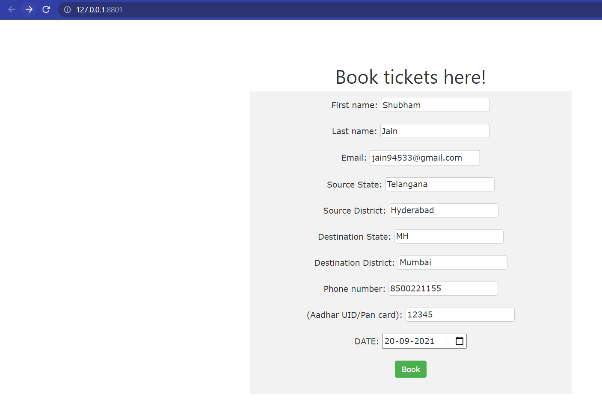

# Flask_Ticket_Booking\
<h1>Flask ticket booking using Flask and Twilio API for Whatsapp.</h1>
The user is first directed to the home screen where the user enters details like travel source and destination, as well as the date etc.

If the booking is confirmed, a confirmation message is shown in green text and a message regarding the booking is sent to the customer on whatsapp else if the booking is not confirmed then the message is displayed in red,
the confirmation depends on the current active cases in the source region.

